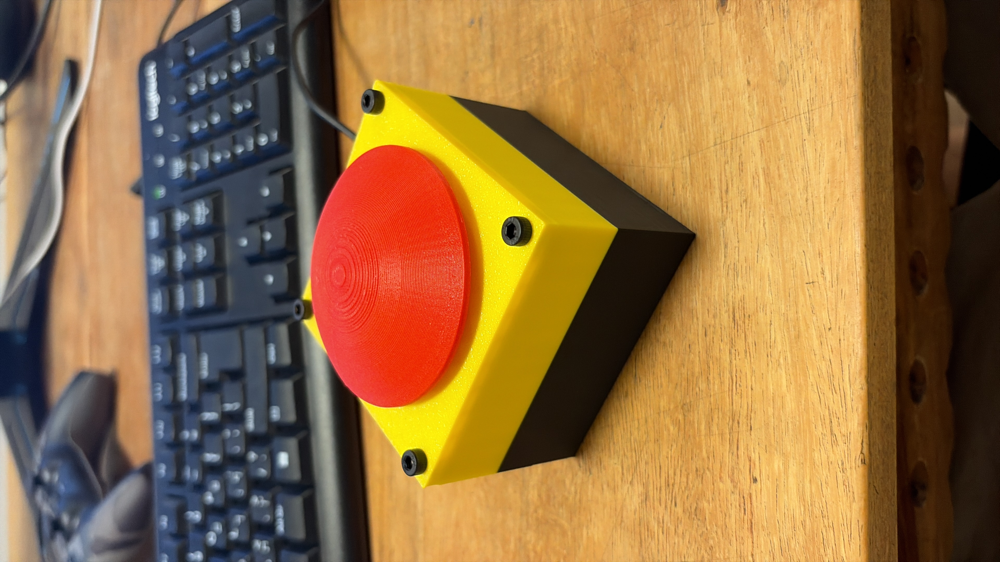
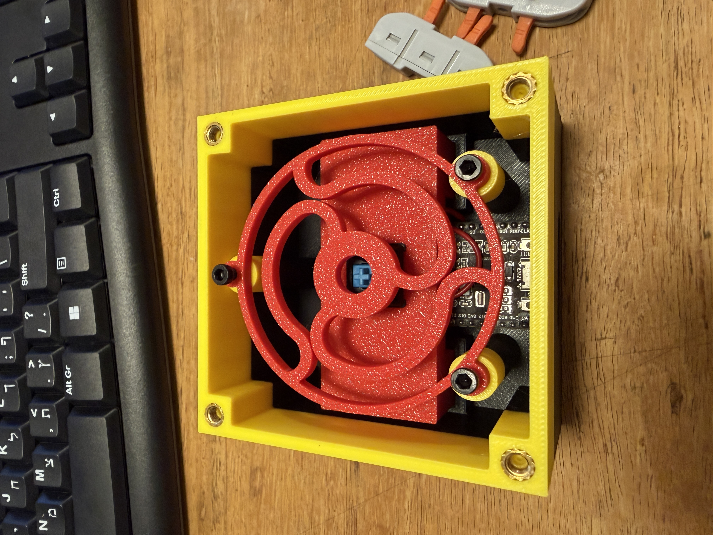

# 📱 Where Is My Phone Button

A standalone, Wi-Fi-enabled physical button that calls your phone when pressed. Built with an ESP32, a satisfying mechanical keyboard switch, and a custom 3D-printed enclosure featuring an engineered flexure spring for perfect tactile feedback. 

No more asking someone else to call your phone or shouting for a smart speaker—just press the button on your desk, and your phone rings.

## ✨ Features
* **Satisfying Tactile Feedback:** Uses a mechanical keyboard switch coupled with a custom 3D-printed stabilizer spring.
* **Standalone Operation:** Connects directly to Wi-Fi via an ESP32; no companion app or bridge required.
* **Reliable API Trigger:** Integrates with the Twilio Voice API to initiate an actual phone call to any verified number.
* **Free Of Charge:** You can use the free trial by Twilio to avoid payment.

## 🛠️ Hardware Requirements
* 1x ESP32 Development Board 
* 1x Cherry MX Mechanical Keyboard Switch
* 3D Printer 
* Micro-USB or USB-C cable for power
* 3x M3*4*4.5 Heat Inserts
* 3x M3 Screws
* 4x M4*4*6 Heat Inserts
* 4x M4 Screws
* Soldering kit

## 🖨️ 3D Printing
The enclosure and custom serpentine flexure spring were designed to provide a crisp return force against the center axis. The design files can easily be modified in Fusion 360 or SolidWorks if you need to adjust the tolerances for your specific printer.
* **Material:** PLA 
* **Settings:** Default Bambu Studio settings for PLA

## 🛠️ Assembly
1. solder two wires for each pin on the switch.
2. Thread the wires frow the U shape part and press the button on it to fit
3. solder the other ends of the wires to the ESP32 GND and G4 pin
4. press the U shape part into the base
5. add the m3 heat insert on the lower 3 holes for the spring
6. screw in the 3d spring
7. add the circular part in a way that the small cylinder fit in the spring center hole
8. add the m3 heat insert on each corner
9. screw in the flat top cover
10. press in the top part of the button

## 💻 Software Setup

### 1. Twilio Configuration
1. Create a free [Twilio](https://www.twilio.com/) account.
2. Get a Trial Phone Number.
